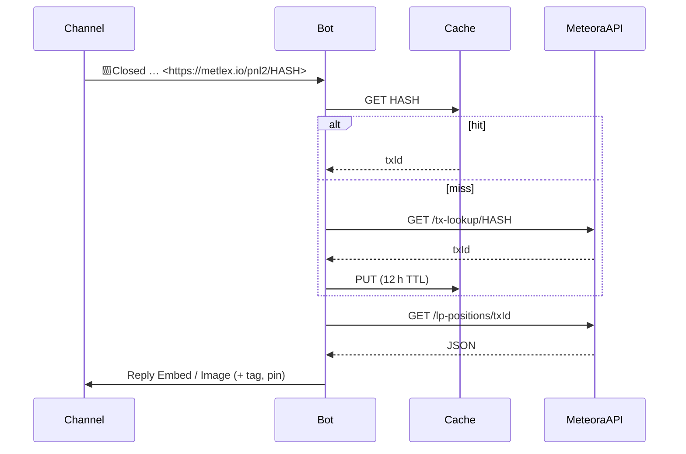

# Metlex Watcher Bot — Project README

A Discord bot that **tracks profitable position‑closure messages** posted by another bot, enriches them with on‑chain data, and **posts neatly‑formatted summaries** (or images) in the channels you choose.
It also supports **scheduled PnL summaries for any Solana wallet**.

---

## ✨ Core Features

| Domain                            | What it does                                                                                                                                                                                                                                                                                                                                                                 |
| --------------------------------- | ---------------------------------------------------------------------------------------------------------------------------------------------------------------------------------------------------------------------------------------------------------------------------------------------------------------------------------------------------------------------------- |
| **Watchers** (channel‑based)      | *Follow* one or more channels, listen for messages that start with `🟨Closed` and contain a Metlex URL. <br>• Resolve the Metlex hash → Meteora position → call **lpagent.io**. <br>• Reply to the original message with an **Embed** (or auto‑generated image) showing PnL, fees, age, etc. <br>• Optional tag `<@user>`/`<@&role>`, auto‑pin, and threshold filter (`±%`). |
| **Wallets** (time‑based)          | Track any Solana wallet and **periodically** post a PnL recap (daily / weekly / monthly) into a chosen channel.                                                                                                                                                                                                                                                              |
| **Admin UX** (slash + components) | Fully managed through slash commands, embeds, buttons, select‑menus, and modals—no config files needed.                                                                                                                                                                                                                                                                      |

---

## 🏗️ Tech Stack

| Layer                      | Choice                                     | Notes                                                |
| -------------------------- | ------------------------------------------ | ---------------------------------------------------- |
| Runtime                    | **Node 22 LTS**                            | Native ES2023, `Promise.withResolvers`               |
| Discord API                | **discord.js 14.19.x** (TypeScript)        | Components v2, modals, channel & mentionable options |
| Storage                    | **AWS DynamoDB**                           | Single‑table design + TTL + GSIs                     |
| Scheduled jobs             | **AWS EventBridge Scheduler + Lambda**     | Wallet recaps (cron Europe/Helsinki)                 |
| Image rendering (optional) | **Canvas (skia‑canvas / @napi-rs/canvas)** | Generates PnL cards when `image=true`                |

---

## 🏛 Architecture Overview

```bash
src/
├─ domain/
│  ├─ entities/            # Business models (Watcher, Wallet)
│  ├─ value-objects/       # Typed primitives (Threshold, Frequency)
│  ├─ interfaces/          # Port definitions (IWatcherRepo, ILpAgentClient, …)
│  └─ errors/              # Domain-specific exceptions
│
├─ application/
│  ├─ use-cases/           # Orchestrators (AddWatcher, ProcessClosedMessage, …)
│  ├─ dtos/                # Zod-validated inputs/outputs
│  └─ errors/              # Use-case failures
│
├─ infrastructure/
│  ├─ repositories/        # DynamoDB implementations
│  ├─ services/            # Discord adapter, Metlex mapper, HTTP client, Canvas
│  └─ config/              # Env & AWS setup
│
├─ presentation/
│  ├─ commands/            # Slash commands (follow, watchers, watch, follows, clear)
│  ├─ listeners/           # Event handlers (closed-message)
│  ├─ components/          # Modals, buttons, select-menus
│  └─ utils/               # Embed builders, interaction collectors
│
├─ schemas/                # Zod schemas for API responses & command options
├─ shared/                 # Logger & global error handler
└─ injection/              # DI container bindings
```

* **Clean Architecture** separates “what” (domain) from “how” (infrastructure).
* **Zod** enforces strict typing at boundaries (DTOs & external APIs).
* **DI Container** (e.g. tsyringe) wires services, repos, and use-cases for easy testing.
* **kebab-case** file naming + TypeScript `strict` + ESLint/Prettier ensure a professional, maintainable codebase.

---

## 🗂️ Data Model (DynamoDB)

| PK                                    | SK                 | Attributes                                                  | Purpose               |
| ------------------------------------- | ------------------ | ----------------------------------------------------------- | --------------------- |
| `GUILD#<guildId>#CHANNEL#<channelId>` | `META`             | `threshold`, `tagId`, `tagType`, `image`, `pin`, `followed` | Watcher (per channel) |
| `GUILD#<guildId>`                     | `WALLET#<address>` | `channelId`, `freq`, `enabled`                              | Wallet recap          |
| `LOOKUP#<metlexHash>`                 | `tx`               | `meteoraTx`, `ts` (TTL 12 h)                                | Hash → tx cache       |

GSIs

* `GSI1`: `followed=true` (streamer)
* `GSI2`: `freq` (wallet scheduler)

---

## 🔌 Slash Commands

| Command               | Args                                   | Scope   | Description                                   |
| --------------------- | -------------------------------------- | ------- | --------------------------------------------- |
| `/follow [channel]`   | optional channel – defaults to current | channel | Start watching a channel                      |
| `/unfollow [channel]` |                                        | channel | Stop watching                                 |
| `/watch <wallet>`     | wallet address                         | guild   | Add a wallet recap                            |
| `/unwatch <wallet>`   |                                        | guild   | Remove wallet recap                           |
| `/watchers`           |                                        | guild   | Show **Watchers Dashboard** (embed + buttons) |
| `/follows`            |                                        | guild   | Show **Wallets Dashboard**                    |
| `/clear [channel]`    | optional channel                       | channel | Delete the bot’s own messages                 |

> All commands require **Administrator** permission.

---

## 🖼️ Dashboard Embeds

### Watchers (`/watchers`)

```
╭─ Watchers (3)
│ • #house-trades   ±5 % | img:❌ | pin:✅ | tag:@Traders
│ • #alpha-drops    ±3 % | img:✅ | pin:❌ | tag:none
│ • #memecoins      ±7 % | img:❌ | pin:✅ | tag:@Alerts
╰──────────────────────────
```

Buttons: **Add Watcher**, **Edit**, **Disable**, **Remove**

### Wallets (`/follows`)

```
╭─ Wallets (3)
│ • Dx8…Yp   #gains   DAY
│ • 9hQ…Sd   #gains   WEEK
│ • A1c…rt   #reports MONTH
╰────────────────────────
```

Buttons: **Add Wallet**, **Manage**, **Toggle**

Modals are used for data entry; each field validated client‑side.

---

## 🔄 Closed‑Message Flow



---

## 🚀 Setup & Development

```bash
npm install
cp .env.example .env        # add Discord token, AWS creds
npm run dev                    # ts-node watch (local)
```

### Register Commands

```bash
npm run register:commands       # pushes global commands via REST
```

### Lint & Build

```bash
npm run check:all
npm run build                   # tsc -> dist/
```

---

## 🛣️ Roadmap

1. **MVP**: `/follow`, `/unfollow`, Closed‑listener → Embed reply.
2. Dashboards `/watchers`, `/follows` (embeds, buttons, modals).
3. Image rendering option (`image=true`).
4. Wallet scheduler (EventBridge + Lambda).
5. Pagination for >25 watchers/wallets.
6. Optional web dashboard / metrics.

---

## 🤝 Contributing

1. Fork & create a feature branch.
2. Follow eslint rules (`pnpm lint --fix`).
3. Submit a pull request with a clear description.

---

### License

MIT © 2025 — *Metlex Watcher Bot*
