# Metlex Watcher Bot — Project README

A Discord bot that **tracks profitable position‑closure messages** posted by another bot, enriches them with on‑chain data, and **posts neatly‑formatted summaries** (or images) in the channels you choose.
It also supports **scheduled PnL summaries for any Solana wallet**.

---

## ✨ Core Features

| Domain                            | What it does                                                                                                                                                                                                                                                                                                                                                                 |
| --------------------------------- | ---------------------------------------------------------------------------------------------------------------------------------------------------------------------------------------------------------------------------------------------------------------------------------------------------------------------------------------------------------------------------- |
| **Watchers** (channel‑based)      | *Follow* one or more channels, listen for messages that start with `🟨Closed` and contain a Metlex URL. <br>• Resolve the Metlex hash → Meteora position → call **lpagent.io**. <br>• Reply to the original message with an **Embed** (or auto‑generated image) showing PnL, fees, age, etc. <br>• Optional tag `<@user>`/`<@&role>`, auto‑pin, and threshold filter (`±%`). |
| **Wallets** (time‑based)          | Track any Solana wallet and **periodically** post a PnL recap (daily / weekly / monthly) into a chosen channel.                                                                                                                                                                                                                                                              |
| **Admin UX** (slash + components) | Fully managed through slash commands, embeds, buttons, select‑menus, and modals—no config files needed.                                                                                                                                                                                                                                                                      |

---

## 🏗️ Tech Stack

| Layer                      | Choice                                     | Notes                                                |
| -------------------------- | ------------------------------------------ | ---------------------------------------------------- |
| Runtime                    | **Node 22 LTS**                            | Native ES2023, `Promise.withResolvers`               |
| Discord API                | **discord.js 14.19.x** (TypeScript)        | Components v2, modals, channel & mentionable options |
| Storage                    | **AWS DynamoDB**                           | Single‑table design + TTL + GSIs                     |
| Scheduled jobs             | **AWS EventBridge Scheduler + Lambda**     | Wallet recaps (cron Europe/Helsinki)                 |
| Image rendering (optional) | **Canvas (skia‑canvas / @napi-rs/canvas)** | Generates PnL cards when `image=true`                |

---

## 📂 Project Layout (suggested)

```
src/
 ├─ commands/
 │   ├─ follow.ts        # /follow & /unfollow
 │   ├─ watch.ts         # /watch & /unwatch
 │   ├─ watchers.ts      # /watchers dashboard
 │   └─ follows.ts       # /follows  dashboard
 ├─ listeners/
 │   └─ closedMessage.ts # 🟨Closed detector → API caller
 ├─ components/
 │   ├─ modals/
 │   ├─ buttons/
 │   └─ menus/
 ├─ dynamo/
 │   └─ client.ts
 ├─ scheduler/
 │   └─ walletSummary.ts # Lambda handler
 └─ utils/
     ├─ metlexMapper.ts
     └─ canvas.ts        # (optional)
```

---

## 🗂️ Data Model (DynamoDB)

| PK                                    | SK                 | Attributes                                                  | Purpose               |
| ------------------------------------- | ------------------ | ----------------------------------------------------------- | --------------------- |
| `GUILD#<guildId>#CHANNEL#<channelId>` | `META`             | `threshold`, `tagId`, `tagType`, `image`, `pin`, `followed` | Watcher (per channel) |
| `GUILD#<guildId>`                     | `WALLET#<address>` | `channelId`, `freq`, `enabled`                              | Wallet recap          |
| `LOOKUP#<metlexHash>`                 | `tx`               | `meteoraTx`, `ts` (TTL 12 h)                                | Hash → tx cache       |

GSIs

* `GSI1`: `followed=true` (streamer)
* `GSI2`: `freq` (wallet scheduler)

---

## 🔌 Slash Commands

| Command               | Args                                   | Scope   | Description                                   |
| --------------------- | -------------------------------------- | ------- | --------------------------------------------- |
| `/follow [channel]`   | optional channel – defaults to current | channel | Start watching a channel                      |
| `/unfollow [channel]` |                                        | channel | Stop watching                                 |
| `/watch <wallet>`     | wallet address                         | guild   | Add a wallet recap                            |
| `/unwatch <wallet>`   |                                        | guild   | Remove wallet recap                           |
| `/watchers`           |                                        | guild   | Show **Watchers Dashboard** (embed + buttons) |
| `/follows`            |                                        | guild   | Show **Wallets Dashboard**                    |
| `/clear [channel]`    | optional channel                       | channel | Delete the bot’s own messages                 |

> All commands require **Administrator** permission.

---

## 🖼️ Dashboard Embeds

### Watchers (`/watchers`)

```
╭─ Watchers (3)
│ • #house-trades   ±5 % | img:❌ | pin:✅ | tag:@Traders
│ • #alpha-drops    ±3 % | img:✅ | pin:❌ | tag:none
│ • #memecoins      ±7 % | img:❌ | pin:✅ | tag:@Alerts
╰──────────────────────────
```

Buttons: **Add Watcher**, **Edit**, **Disable**, **Remove**

### Wallets (`/follows`)

```
╭─ Wallets (3)
│ • Dx8…Yp   #gains   DAY
│ • 9hQ…Sd   #gains   WEEK
│ • A1c…rt   #reports MONTH
╰────────────────────────
```

Buttons: **Add Wallet**, **Manage**, **Toggle**

Modals are used for data entry; each field validated client‑side.

---

## 🔄 Closed‑Message Flow

```mermaid
sequenceDiagram
  participant Channel
  participant Bot
  participant Cache
  participant MeteoraAPI
  Channel->>Bot: 🟨Closed … <https://metlex.io/pnl2/HASH>
  Bot->>Cache: GET HASH
  alt hit
    Cache-->>Bot: txId
  else miss
    Bot->>MeteoraAPI: GET /tx‑lookup/HASH
    MeteoraAPI-->>Bot: txId
    Bot->>Cache: PUT (12 h TTL)
  end
  Bot->>MeteoraAPI: GET /lp-positions/txId
  MeteoraAPI-->>Bot: JSON
  Bot->>Channel: Reply Embed / Image (+ tag, pin)
```



---

## 🚀 Setup & Development

```bash
pnpm install
cp .env.example .env        # add Discord token, AWS creds
pnpm dev                    # ts-node watch (local)
```

### Register Commands

```bash
pnpm register:commands       # pushes global commands via REST
```

### Lint & Build

```bash
pnpm lint
pnpm build                   # tsc -> dist/
```

---

## 🛣️ Roadmap

1. **MVP**: `/follow`, `/unfollow`, Closed‑listener → Embed reply.
2. Dashboards `/watchers`, `/follows` (embeds, buttons, modals).
3. Image rendering option (`image=true`).
4. Wallet scheduler (EventBridge + Lambda).
5. Pagination for >25 watchers/wallets.
6. Optional web dashboard / metrics.

---

## 🤝 Contributing

1. Fork & create a feature branch.
2. Follow eslint rules (`pnpm lint --fix`).
3. Submit a pull request with a clear description.

---

### License

MIT © 2025 — *Metlex Watcher Bot*
